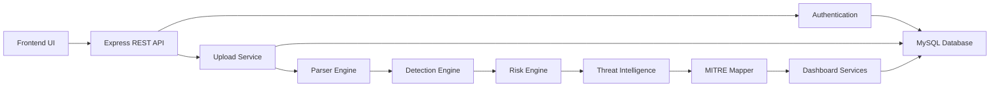
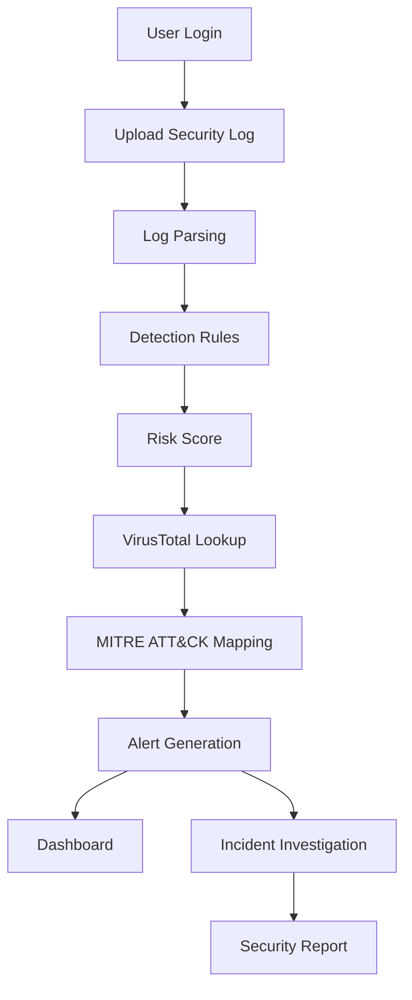

<div align="center">

# 🛡️ ThreatLens

### Threat Detection & Incident Response Platform

*A Full-Stack Security Operations Center (SOC) Platform for Automated Threat Detection, Log Analysis, Incident Investigation, Threat Intelligence Enrichment and Security Reporting.*

<p>


</p>

*A cybersecurity internship capstone project that simulates the workflow of a modern Security Operations Center (SOC), enabling analysts to detect, investigate and respond to cyber threats through automated log analysis and interactive security dashboards.*

</div>

---

# 📖 Table of Contents

- [Project Overview](#-project-overview)
- [Problem Statement](#-problem-statement)
- [Key Features](#-key-features)
- [Technology Stack](#-technology-stack)
- [System Architecture](#-system-architecture)
- [Application Workflow](#-application-workflow)
- [Project Modules](#-project-modules)
- [Screenshots](#-screenshots)
- [Installation](#-installation)
- [Project Structure](#-project-structure)
- [Future Enhancements](#-future-enhancements)
- [Learning Outcomes](#-learning-outcomes)
- [Author](#-author)

---

# 📌 Project Overview

ThreatLens is a full-stack web application developed to simulate the workflow of a modern Security Operations Center (SOC). The platform provides a centralized environment where analysts can securely upload security logs, detect malicious activities, investigate incidents, visualize Indicators of Compromise (IOCs), and generate detailed security reports.

Modern organizations generate enormous volumes of logs every day, making manual investigation both time-consuming and error-prone. ThreatLens streamlines this process by combining automated log parsing, rule-based threat detection, threat intelligence enrichment, interactive dashboards, and investigation tools into a single platform.

Built using Node.js, Express.js, Prisma ORM, MySQL, and a responsive frontend, the application demonstrates secure software development practices while incorporating real-world cybersecurity concepts such as the MITRE ATT&CK framework, IOC correlation, risk scoring, and incident response.

The project was developed as an internship capstone to bridge the gap between theoretical cybersecurity knowledge and practical SOC operations by replicating how analysts investigate security events from initial detection through final reporting.

---

# 🎯 Problem Statement

Security analysts often work with data from multiple tools to investigate a single incident. Logs may reside in one system, threat intelligence in another, dashboards elsewhere, and reporting tools separately. This fragmented workflow increases investigation time and the likelihood of missing critical indicators.

ThreatLens addresses this challenge by providing a unified platform where log ingestion, detection, enrichment, visualization, investigation, and reporting are integrated into a seamless workflow. The application demonstrates how automation can reduce analyst workload while improving the speed and consistency of security investigations.

---

# ✨ Key Features

## 🔐 Secure Authentication

- User Registration
- Secure Login
- JWT Authentication
- Password Hashing using bcrypt
- Protected API Routes
- User-specific data isolation

---

## 📁 Log Management

- Upload security log files
- Drag-and-drop file upload
- Upload history
- Processing status tracking
- Secure file validation
- Multiple log format support

---

## ⚙️ Detection Engine

ThreatLens includes a rule-based detection engine capable of identifying common attack patterns from uploaded log files.

Implemented detection rules include:

- SQL Injection
- Cross-Site Scripting (XSS)
- Directory Traversal
- Suspicious User-Agent Detection
- Sensitive File Access

---

## 🌐 Threat Intelligence

Security events are enriched using external threat intelligence to improve investigation quality.

Features include:

- VirusTotal integration
- Reputation lookup
- IOC enrichment
- External threat validation

---

## 🎯 MITRE ATT&CK Mapping

ThreatLens automatically maps detected activities to the MITRE ATT&CK framework, helping analysts understand attacker tactics and techniques during investigations.

---

## 📊 Security Dashboard

The dashboard provides a real-time overview of platform activity through interactive charts and security metrics including:

- Alert Summary
- Severity Distribution
- Attack Trends
- Top Source Countries
- Recent Alerts
- MITRE ATT&CK Overview

---

## 🚨 Alert Management

Detected threats are automatically converted into alerts containing:

- Risk Score
- Severity Level
- Detection Rule
- Timestamp
- IOC Details
- Investigation Status

---

## 🔍 IOC Relationship Graph

ThreatLens visualizes relationships between Indicators of Compromise through an interactive graph, allowing analysts to quickly understand how malicious entities are connected during an investigation.

---

## 📅 Incident Investigation

The investigation module combines multiple sources of information into a single view including:

- Incident Timeline
- Threat Intelligence
- IOC Relationships
- MITRE ATT&CK Mapping
- Risk Assessment

---

## 📄 Security Reporting

The reporting module enables analysts to review completed investigations and generate structured security reports summarizing threats, findings, and recommended actions.

---

# 🚀 Why ThreatLens?

Unlike traditional log viewers, ThreatLens combines multiple stages of the incident response lifecycle into one integrated platform.

✔ Secure authentication

✔ Automated log parsing

✔ Rule-based threat detection

✔ Threat intelligence enrichment

✔ MITRE ATT&CK mapping

✔ IOC relationship visualization

✔ Dynamic risk assessment

✔ Interactive dashboards

✔ Incident investigation

✔ Security reporting

---

# 💻 Technology Stack

| Category | Technology |
|----------|------------|
| **Frontend** | HTML5, CSS3, JavaScript |
| **Backend** | Node.js |
| **Framework** | Express.js |
| **Database** | MySQL |
| **ORM** | Prisma ORM |
| **Authentication** | JWT, bcrypt |
| **File Upload** | Multer |
| **Charts & Analytics** | Chart.js |
| **Graph Visualization** | Cytoscape.js |
| **Threat Intelligence** | VirusTotal API |
| **Version Control** | Git & GitHub |

---

# 🏗️ System Architecture

ThreatLens follows a modular three-tier architecture that separates the presentation layer, application logic, and database. This design improves maintainability, scalability, and security while allowing each module to evolve independently.



---

# 🔄 Application Workflow

ThreatLens processes uploaded logs through multiple analysis stages before presenting actionable security insights to the analyst.



---

# 🧩 Project Modules

## 🔐 1. Authentication Module

**Purpose**

Provides secure access to the platform using JSON Web Tokens (JWT).

### Features

- User Registration
- Secure Login
- Password Hashing using bcrypt
- JWT Token Generation
- Protected Routes
- User Session Validation

### Security Measures

- Passwords are never stored in plain text.
- Every protected API validates JWT tokens before granting access.
- Each user can only access their own uploads, alerts, and reports.

---

## 📁 2. Log Upload Module


The upload module enables analysts to securely submit security logs for automated analysis.

### Features

- Drag-and-drop interface
- Multiple log format support
- Upload history
- Processing status tracking
- File validation
- User-specific uploads

Supported formats include:

- `.log`
- `.txt`
- `.json`
- `.csv`

Uploaded files are stored securely before being passed to the parsing engine.

---

## ⚙️ 3. Log Parsing Engine

Once uploaded, logs are processed by the parser engine.

The parser extracts relevant event information including:

- Timestamp
- Source IP
- Destination IP
- HTTP Requests
- User Agent
- Request URI
- Event Type

This structured data becomes the foundation for threat detection and investigation.

---

## 🚨 4. Detection Engine

ThreatLens implements a modular rule-based detection engine capable of identifying suspicious activity from parsed log events.

### Detection Rules

| Rule | Purpose |
|------|---------|
| SQL Injection | Detect malicious SQL payloads |
| Cross-Site Scripting | Detect injected JavaScript |
| Directory Traversal | Detect path traversal attempts |
| Suspicious User-Agent | Identify malicious scanners |
| Sensitive File Access | Detect access to protected resources |

Every rule generates structured detections containing severity, description, affected assets, and evidence.

---

## 📈 5. Dynamic Risk Scoring

Each alert is assigned a dynamic risk score based on multiple security factors.

Risk calculation considers:

- Detection severity
- Number of indicators
- Threat intelligence reputation
- Attack frequency
- MITRE ATT&CK mapping

This enables analysts to prioritize the most critical incidents first.

---

## 🌐 6. Threat Intelligence Integration

ThreatLens enriches detected indicators using VirusTotal.

Threat intelligence provides:

- IP reputation
- Malicious detection count
- Community reputation
- Suspicious activity indicators

External enrichment improves investigation quality by providing additional context for each security event.

---

## 🎯 7. MITRE ATT&CK Mapping

Detected attacks are automatically associated with relevant MITRE ATT&CK tactics and techniques.

This mapping helps analysts understand:

- Attacker objectives
- Attack progression
- Techniques used
- Defensive recommendations

MITRE mapping also provides standardized terminology for reporting and investigation.

---

## 📊 8. Security Dashboard

The Security Dashboard serves as the central monitoring interface of ThreatLens, providing analysts with an overview of platform activity and detected threats.

### Dashboard Highlights

- Security overview cards
- Total uploaded logs
- Total alerts generated
- High-risk incidents
- Severity distribution chart
- Attack trend visualization
- Top attacking countries
- Recent alerts feed
- MITRE ATT&CK summary

The dashboard is powered by REST APIs that retrieve real-time analytics from the database, giving analysts immediate visibility into ongoing investigations.

---

## 🚨 9. Alert Management

ThreatLens automatically generates alerts whenever suspicious activity is detected during log analysis.

Each alert includes:

- Alert Title
- Severity Level
- Risk Score
- Detection Rule
- Source IP
- Timestamp
- Investigation Status

Analysts can review alerts, filter incidents, and investigate suspicious activities through an intuitive interface.

---

## 🔍 10. Incident Investigation

The Incident Investigation module consolidates all relevant information required to analyze a security event.

### Investigation View

- Alert Summary
- Threat Intelligence
- VirusTotal Reputation
- MITRE ATT&CK Mapping
- IOC Relationship Graph
- Timeline of Events
- Dynamic Risk Score

This enables analysts to move from detection to investigation without switching between multiple tools.

---

## 🕸️ 11. IOC Relationship Graph

ThreatLens visualizes relationships between Indicators of Compromise (IOCs) using an interactive graph.

Nodes may include:

- Source IP
- Destination IP
- URLs
- Files
- MITRE Techniques
- Alerts

Graph visualization makes it easier to understand attack paths and identify related indicators during investigations.

---

## 📄 12. Report Generation


The reporting module allows analysts to review previously investigated incidents and generate structured security reports.

Reports include:

- Incident Summary
- Severity
- Detection Results
- Risk Assessment
- Threat Intelligence Findings
- Recommended Actions

The reporting interface provides a centralized history of investigations for future reference and documentation.

---

# 📸 Screenshots

## Login Page


Secure authentication using JWT with encrypted password storage.

---

## Dashboard


Interactive security metrics including severity distribution, attack trends, recent alerts, and threat summaries.

---

## Upload Logs


Upload security logs through a drag-and-drop interface with processing status and upload history.

---

## Alerts


Automatically generated alerts with severity classification and investigation details.

---

## Incident Investigation


Comprehensive incident analysis combining MITRE ATT&CK, threat intelligence, IOC visualization, and risk scoring.

---

## Reports


Generate structured reports summarizing findings, evidence, and recommended actions.

---

# ⚙️ Installation

## Clone the Repository

```bash
git clone https://github.com/YOUR_USERNAME/ThreatLens.git
```

```bash
cd ThreatLens
```

## Install Dependencies

```bash
npm install
```

## Configure Environment Variables

Create a `.env` file in the backend directory.

```env
DATABASE_URL=your_database_url
JWT_SECRET=your_secret_key
VT_API_KEY=your_virustotal_api_key
```

## Start the Application

```bash
npm start
```

The application will be available locally after the backend server starts successfully.

---

# 📂 Project Structure

```
ThreatLens/
│
├── backend/
│   ├── controllers/
│   ├── middleware/
│   ├── prisma/
│   ├── routes/
│   ├── services/
│   └── utils/
│
├── frontend/
│   ├── css/
│   ├── js/
│   └── pages/
│
├── uploads/
├── screenshots/
├── README.md
└── package.json
```

---

# 🚀 Future Enhancements

Future improvements planned for ThreatLens include:

- Real-time WebSocket monitoring
- Email alert notifications
- Role-Based Access Control (RBAC)
- Sigma rule support
- YARA rule integration
- Threat intelligence feed aggregation
- Docker deployment
- Cloud hosting
- AI-assisted threat analysis
- Advanced report export (PDF)

---

# 🎓 Learning Outcomes

Developing ThreatLens provided hands-on experience in:

- Secure authentication and authorization
- REST API development
- Database design with Prisma ORM
- Security log parsing
- Rule-based threat detection
- Threat intelligence integration
- MITRE ATT&CK mapping
- Interactive dashboard development
- Incident response workflows
- Full-stack application architecture

---

# 👨‍💻 Author

**Aakshath SV Singh**

**BCA (Cybersecurity)**

Kristu Jayanti College

**Internship Capstone Project**

---

# 📄 License

This project is intended for educational and portfolio purposes.

Licensed under the **MIT License**.

---

<div align="center">

### ⭐ If you found this project interesting, consider giving it a star!

**Thank you for visiting the ThreatLens repository.**

</div>
